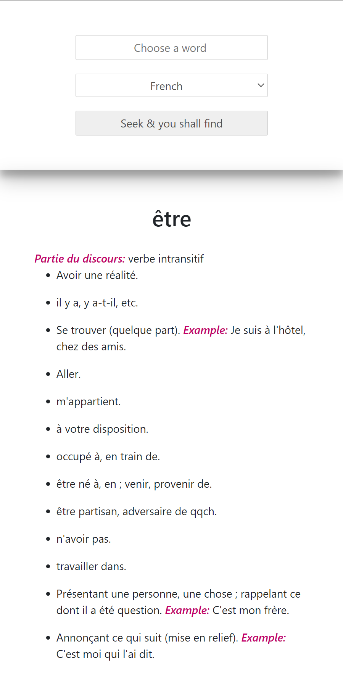
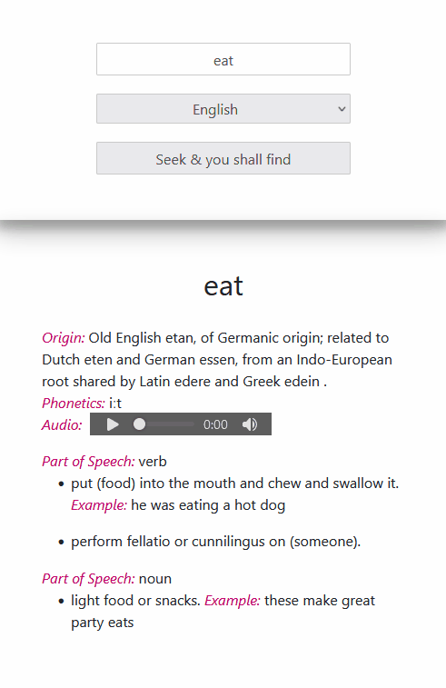

# Intro to my second project

The multilingual dictionary project was developed as part of a DCI API module taught by Syed Naqvi. [[This is a link to Syed Naqvi's github.com/nrcool](https://github.com/nrcool)] 

## Library Platform

This project was developed using React. [[This is a link to React](https://reactjs.org/)]

## Free Dictionary API
The dictionary fetches data dynamically from the Free Dictionary API and draws upon two endpoints, namely the language and the word to be defined. [[This is a link to the Free Dictionary API ](https://dictionaryapi.dev/)]

## Multilingual

The dictionary is multilingual and provides translations in the following languages:

- French 
- English
- Italian
- German

## Items

The data provided upon word search is dynamic and depends on item availabilities in the dictionary: 

- origin
- phonetics
- audio
- part of speech
- examples

If a word remains unlocated upon search a message in the relevant language is provided to this effect.  

## Design

Colleagues say that the design is simple, clean and encapsulates a striking colour scheme. 

## Snippets

The following are some image snippets. The project is responsive.

### Png file

### Gif file

